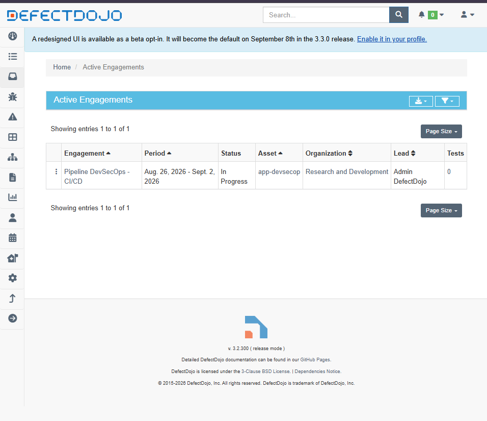
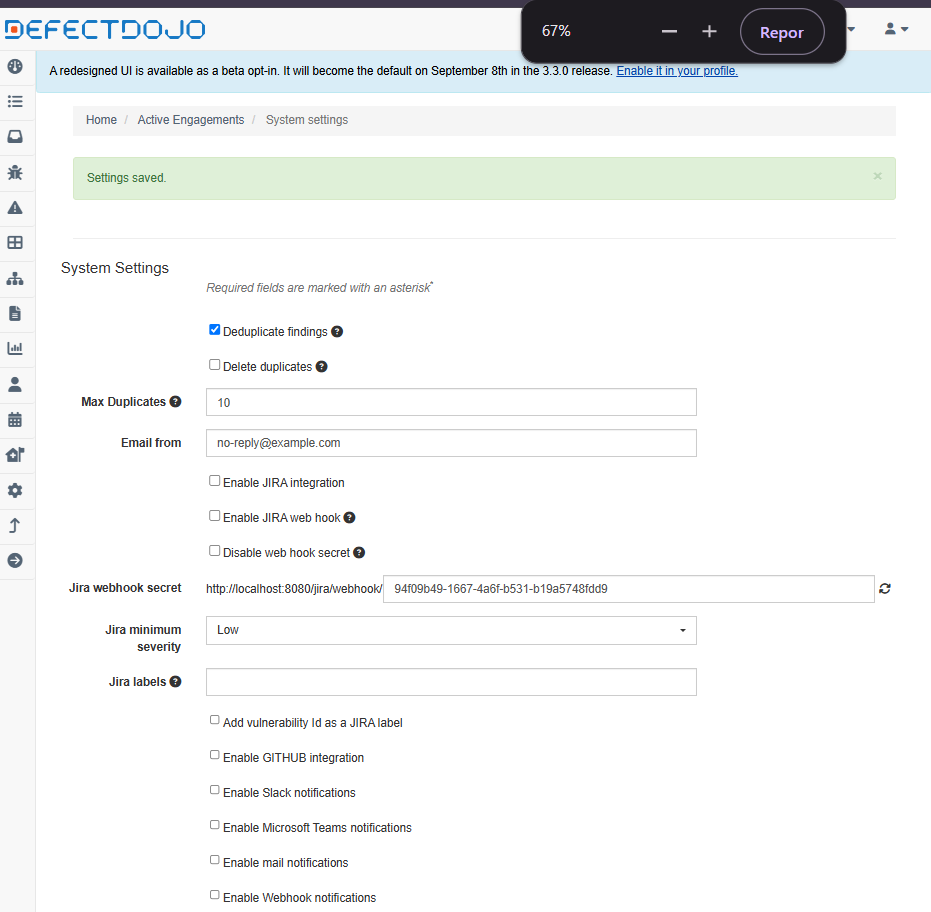
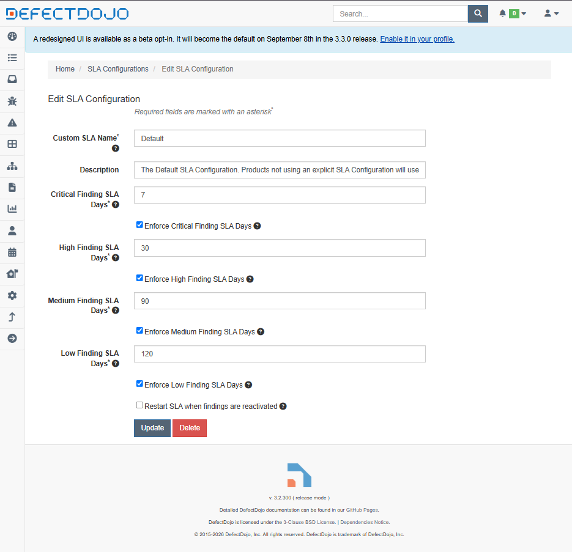
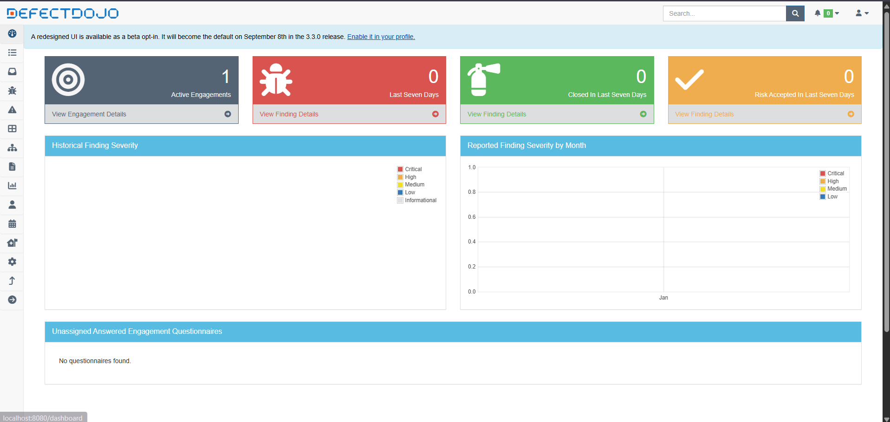

# Evidências de Governança e Triagem no DefectDojo (PBI-61)

Este documento reúne os registros e evidências de configuração do OWASP DefectDojo para consolidação e gestão centralizada de vulnerabilidades da esteira DevSecOps.

---

## 1. Mapeamento de Produto e Engajamento (Task 336)
Configuração do ativo da aplicação e criação do ciclo de testes integrado à esteira de CI/CD:
* **Asset:** `app-devsecop`
* **Engagement:** `Pipeline DevSecOps - CI/CD`
* **Status:** `In Progress`

---

## 2. Validação de Deduplicação Automática (Task 337)
Ativação da flag global de deduplicação e achados similares para consolidação de alertas repetidos dos scanners:
* **Deduplicate findings:** Habilitado
* **Enable Similar Findings:** Habilitado

---

## 3. Mapeamento de Severidades e SLAs de Risco (Task 338)
Definição dos prazos de remediação por nível de criticidade:
* **Critical:** 7 dias
* **High:** 30 dias
* **Medium:** 90 dias
* **Low:** 120 dias

---

## 4. Dashboard Operacional (Task 310)
Visão consolidada do painel do DefectDojo pronto para ingestão de relatórios:

